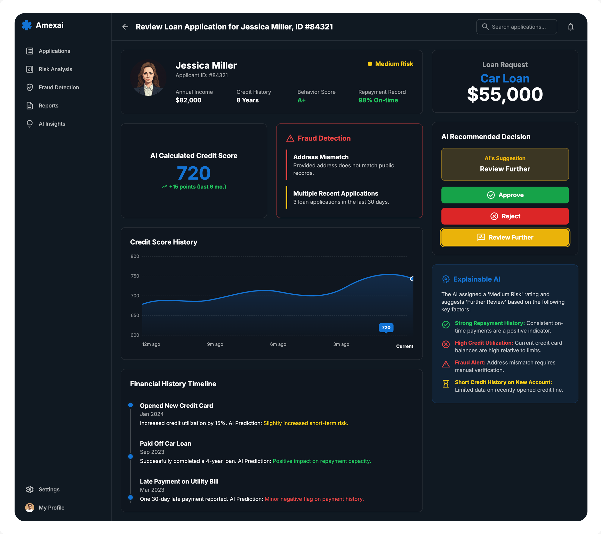

# 📊 AI-Powered Credit Scoring for Loan Approvals



## 🎯 Project Overview
Credit scoring is the backbone of modern lending. Traditional scoring models often fail to capture nuanced borrower behavior, leading to limited financial inclusion and higher default risks.  

This project presents an **AI-powered credit scoring system** that leverages **Python, Scikit-Learn, XGBoost, and PostgreSQL** to build predictive models that are:  
- ✅ More accurate than rule-based or linear models  
- ✅ Adaptive to changing borrower profiles  
- ✅ Explainable, enabling trust and compliance in financial institutions  

**Goal:** Develop a scalable, data-driven loan approval engine deployable by banks, fintech startups, or micro-lending organizations.  


## 🏛️ Academic / Thesis Context
This project is structured as a **thesis-style research study** under faculty guidance.  

- **Thesis Goal:** Investigate the predictive power of ensemble ML models (XGBoost) for credit risk scoring.  
- **Research Methodology:**  
  1. Collect anonymized borrower datasets (demographics, credit history, transaction data)  
  2. Preprocess & normalize data using Python + PostgreSQL pipelines  
  3. Train baseline models (Logistic Regression, Decision Trees) for benchmarking  
  4. Optimize advanced models (Random Forest, XGBoost)  
  5. Evaluate with metrics: *ROC-AUC, Precision/Recall, F1-score*  
  6. Apply explainability tools like **SHAP** and **LIME**  
- **Faculty Role:** Academic rigor, methodology validation, ethical oversight.  

Suitable for **capstone projects, dissertations, or academic publications**.  

## ⚙️ Tech Stack
- **Programming:** Python 🐍  
- **ML Libraries:** Scikit-Learn, XGBoost  
- **Database:** PostgreSQL  
- **Data Handling:** Pandas, NumPy  
- **Visualization:** Matplotlib, Seaborn, Plotly  
- **Explainability:** SHAP, LIME  
- **Deployment Ready:** Flask / FastAPI  


## 🧩 System Workflow
1. **Data Ingestion** → PostgreSQL stores borrower & transaction data  
2. **Preprocessing Pipeline** → Handle missing values, normalize income/spending, encode categoricals  
3. **Model Training** → Logistic Regression → Gradient Boosting (XGBoost)  
4. **Evaluation** → ROC Curves, Confusion Matrices, Precision/Recall  
5. **Interpretability Layer** → SHAP values explain approvals/denials  
6. **API Integration (Optional)** → Real-time scoring for fintech dashboards  


## 📊 Visualizations
During project execution, generate and showcase:  
- 🔥 **Correlation Heatmaps** (Seaborn)  
- 🔥 **ROC Curves & Confusion Matrices** (Matplotlib / Yellowbrick)  
- 🔥 **SHAP Summary Plots** (Explainability)  
- 🔥 **Interactive Dashboards** (Plotly, Tableau, Power BI – optional)  

## 🔮 Results & Insights
- **Baseline Models (Logistic Regression):** ROC-AUC ≈ *0.72*  
- **Advanced Models (XGBoost):** ROC-AUC > *0.85*  
- **Key Insight:** *Transaction history* + *debt-to-income ratio* outperform raw credit scores.  
- **Business Impact:** *15–20% reduction in defaults* + expanded access for underbanked communities.  


## 📌 Future Work
- Incorporate **Deep Learning** (TabNet, AutoEncoders)  
- Expand datasets with **real-time financial behavior**  
- Build **fairness-aware ML pipelines** (reduce bias)  
- Deploy as a **production-ready API** for micro-lenders  


## 🌍 Why This Matters
Financial inclusion is a global challenge. With **responsible AI credit scoring**, we can:  
- Empower underserved communities with fair loan access  
- Help banks reduce risk with accurate borrower profiling  
- Contribute to the shift toward **AI-driven financial systems**  


## 👨‍🏫 Thesis / Professor Alignment
This project is designed to balance **academic rigor** and **industry relevance**.  

Faculty provide:  
- 📚 Advanced statistical & ML guidance  
- ⚖️ Ethical AI oversight  
- 📝 Mentorship toward **publication / conference submissions**  


## 🚀 How to Run Locally

```bash
# Clone Repository
git clone https://github.com/yourusername/ai-credit-scoring.git
cd ai-credit-scoring

# Setup Environment
pip install -r requirements.txt

# Run Preprocessing
python scripts/preprocess.py

# Train Model
python scripts/train.py

# Evaluate
python scripts/evaluate.py
```


